Binary Clock

Tom Aarts

Pi4j id:taartspi

May 15, 2024


The intro is a two minute video. It demonstrates the Binary Clock Incrementing to the next minute and the next hour.  What you see is the Hour Minute and Second displayed in BCD (Binary Coded Decimal)


```
{}
 How to add a video ???
{}
```


Design document describing the LED  PCF8575 connections, and the Java implementation that drives the clock LEDs.
Note: there are two PCF8575 IC used in this design.  This IC is used as it can provide the current flow to 
directly control the LED.   Alternative IC like the MCP23017 with less current capability would require a NPN 
transistor in the circuit.  


# Wiring

The following documents the connections for a single LED

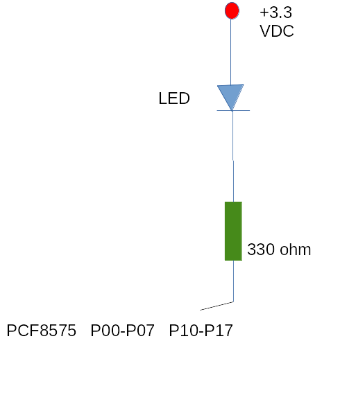

# LED Anode/Cathode

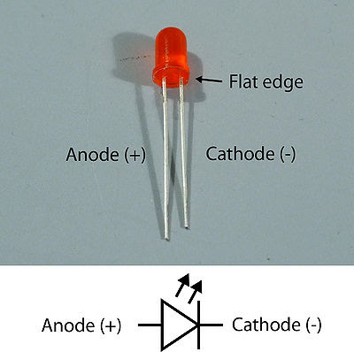

# LED assignment
Chart of 20 LED showing color assignment.
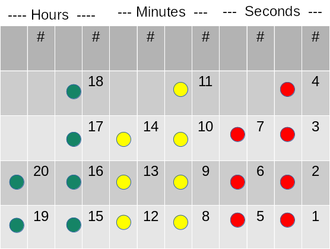

# Overall LED connections
Higher level example of the twenty LED connections. This shows half of the LEDs. the same connection pattern 
repeats.

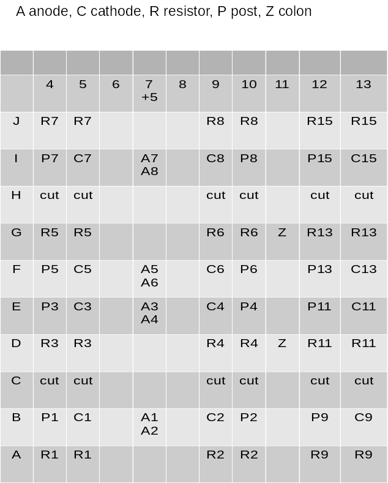


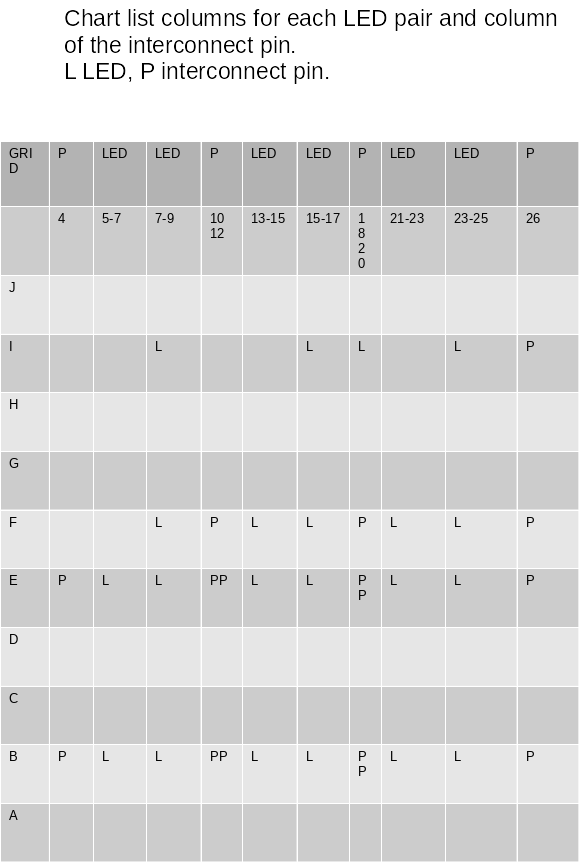


# Parts

## AITIAO  PCF8575  16 IO Expander
Since there are 20 LEDs, two ICs are required. In my case these parts I purchased do not match their documentation.  My chip has solder bridges for all three address bits, A0 A1 A2.  Also their description of a solder bridge across VCC-VDD appears to be backwards.  I think as  cautionary tale, I soldered the ICs down and lost access to their VCC-VDD bridge and couldn’t experiment.   
This companies chip functions correctly with the Chip VCC and LED anode voltage equal.

## LEDs
Cheapos.

## Prototype board
Half Size BreadBoard.  You can see in the chart ‘Overall LED Connections’ I cut paths on the planar so the LEDs 
could be placed close to each other.  You can buy larger BreadBoards from ElectroCookie, called snappable. 
On these boards each row, ie: A B C …  has three solder lands and each letters trace are not connected to the 
next letter, so no trace cutting and there is more area for components and soldering.

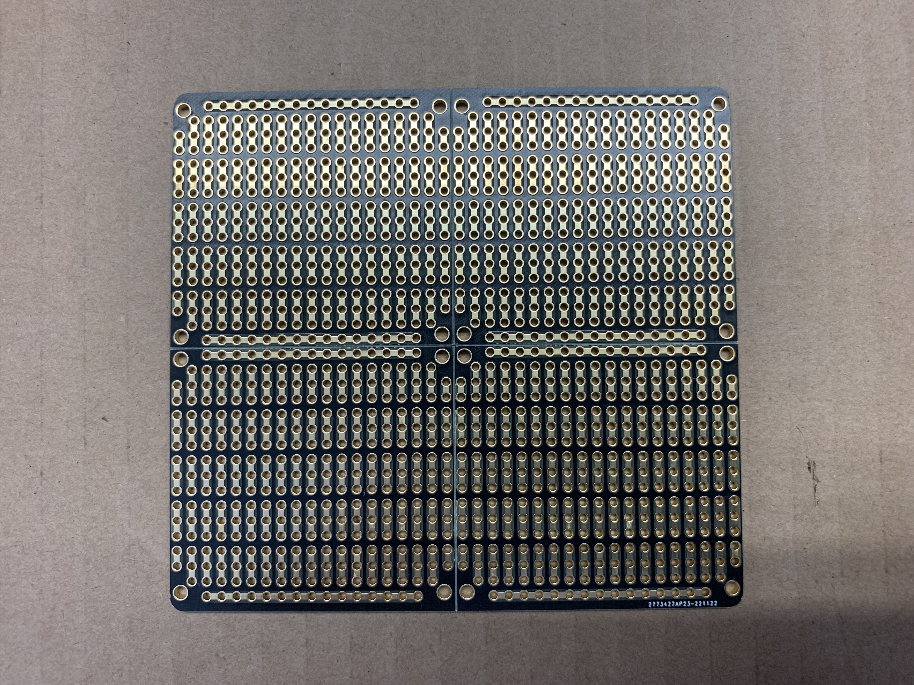

# PCF8575  Connection Assignment

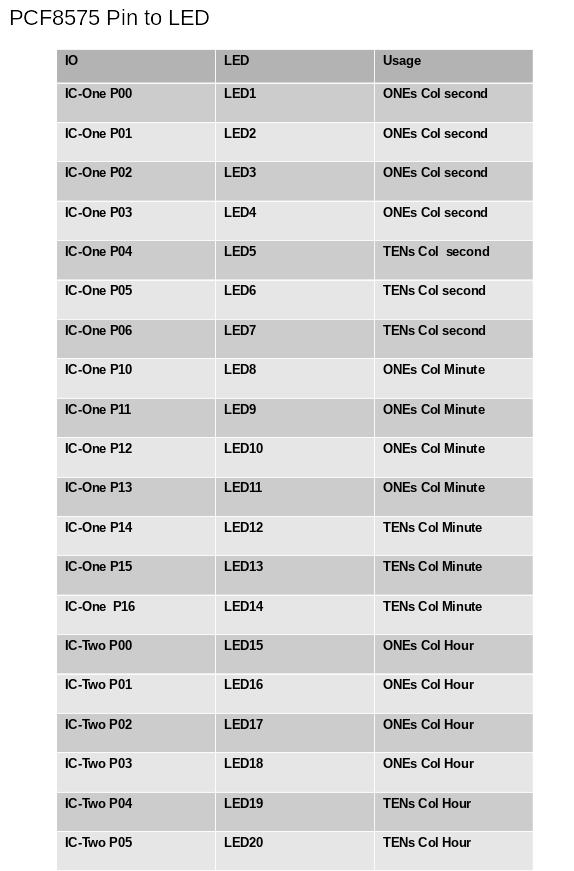

# Pi Connectins

The PCF8575 ICs and the Diode anodes connect to the Pi 3.3v
The PCF8575 ICs connect to the Pi Ground.
The PCF8575 ICs connect to the Pi SDA and SCL (I2C).


# Java
See project https://github.com/taartspi/pi4j-binary-clock.git

Developed using pi4j 2.6.0-SNAPSHOT.


# Completed project

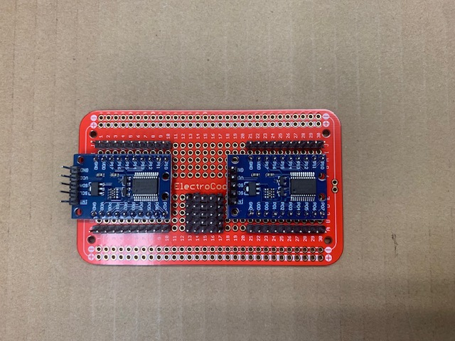

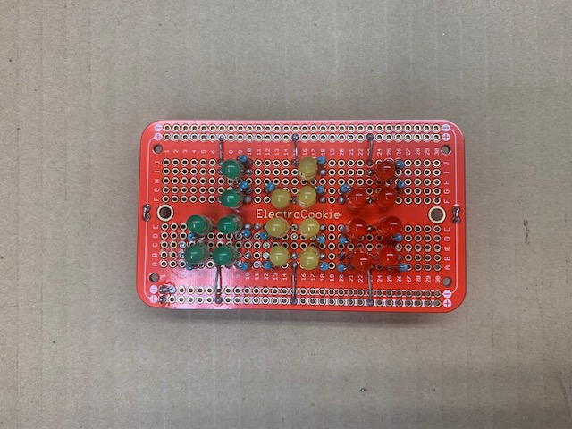

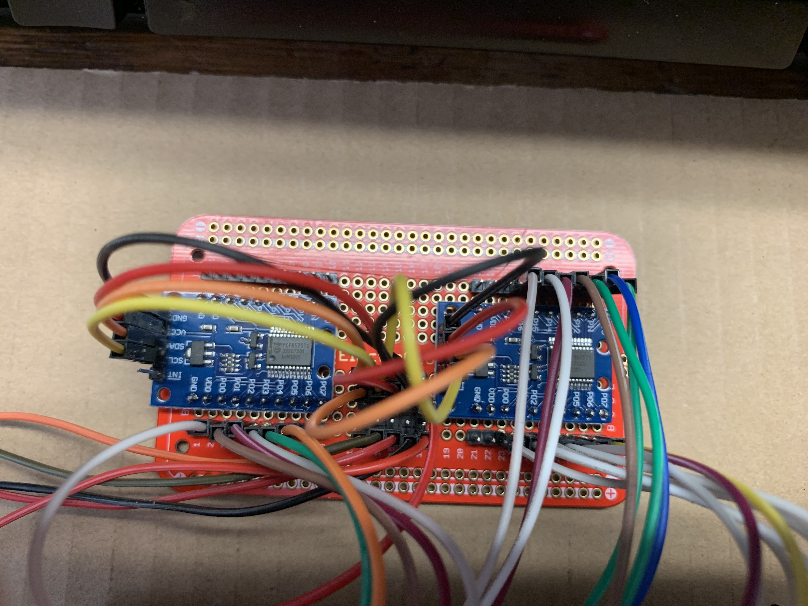

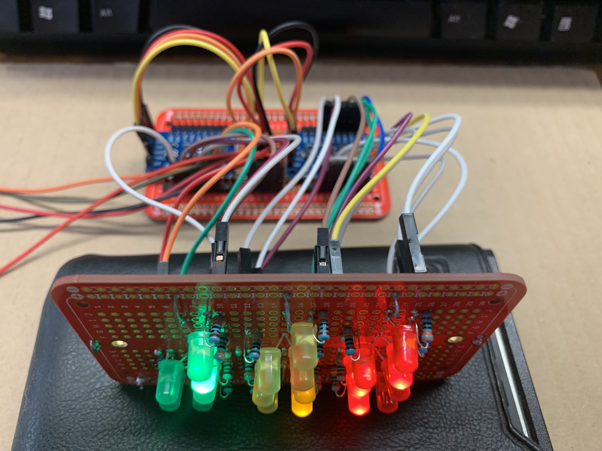


# Alternate IC
You could use a MCP23008 or MCP23017 as the IC. There are a few more steps to configure the IC, and its limited
current capability requires a NPN transistor to switch the LED current.


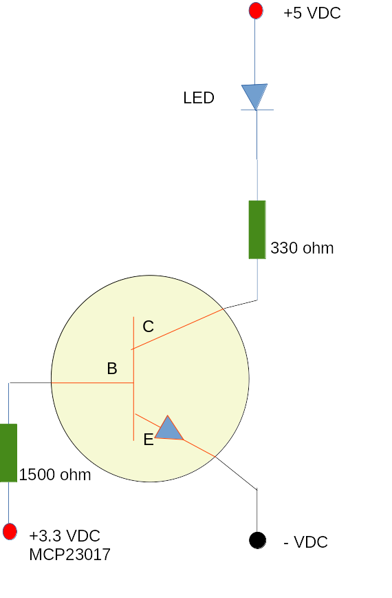

